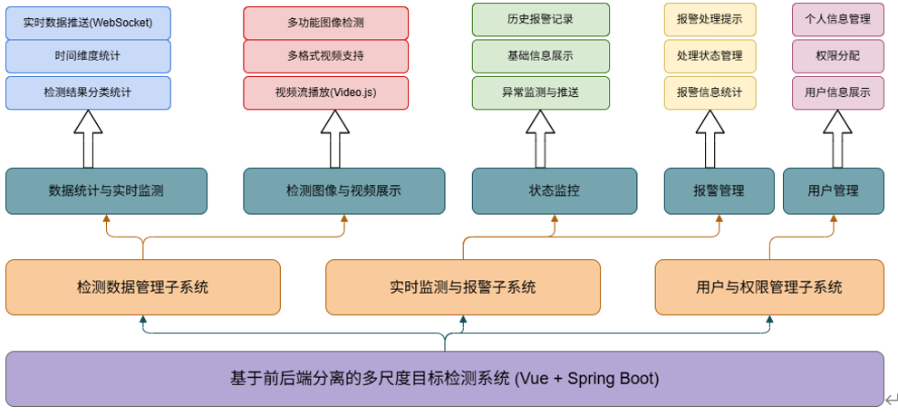
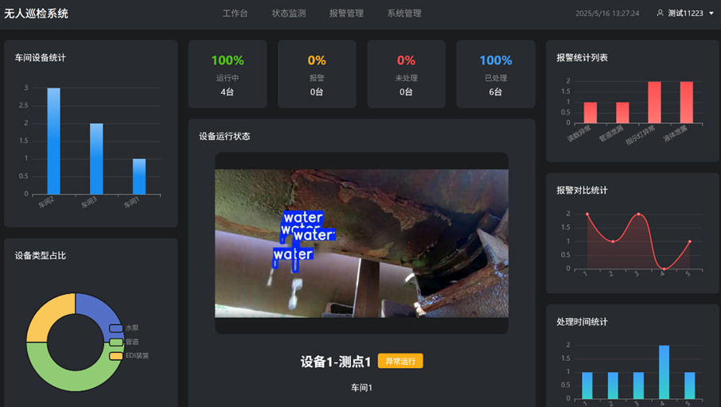
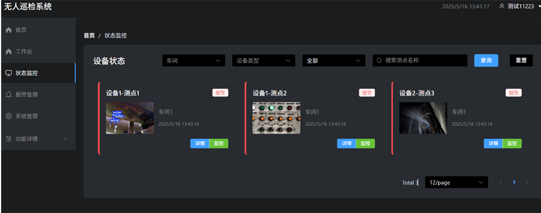
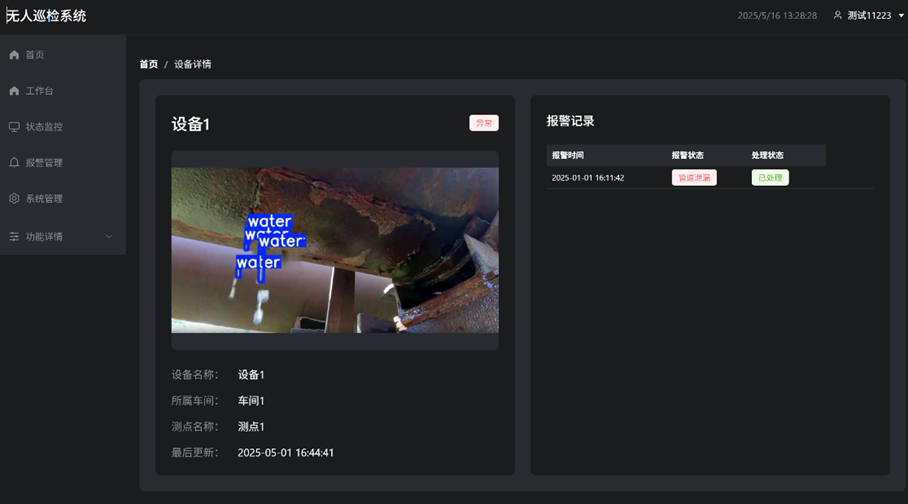
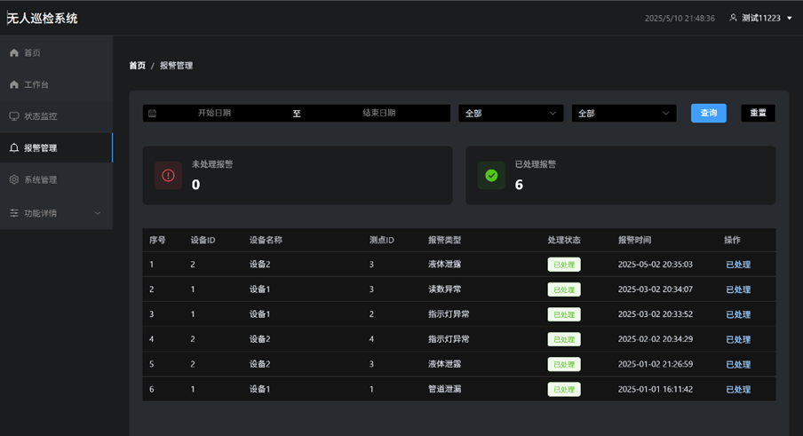
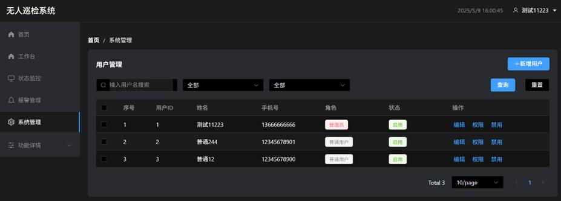

# 无人巡检系统

## 项目介绍
无人巡检系统是一个集前端展示与后端服务于一体的综合性系统，旨在实现设备的自动化巡检和管理。前端基于 Vue 3 + TypeScript + Element Plus 构建，拥有现代化的深色主题界面和丰富的交互功能；后端采用 Spring Boot 搭建，为前端提供稳定的数据接口和业务逻辑支持。系统涵盖了设备状态管理、报警信息管理、用户信息管理等核心业务，具备实时数据更新、多维度数据筛选、完善的权限控制等特色功能。

## 项目结构
```
UnmannedInspectionSystem/
├── front/        # 前端工程
└── backend/      # 后端工程
```

## 技术栈
### 前端
- **Vue 3**：构建用户界面的渐进式 JavaScript 框架。
- **TypeScript**：为 JavaScript 增添静态类型，提高代码的可维护性和可靠性。
- **Element Plus**：基于 Vue 3 的 UI 组件库，提供丰富的组件和良好的用户体验。

### 后端
- **Spring Boot**：简化 Spring 应用的开发过程，提供快速搭建和部署的能力。
- **MyBatis**：优秀的持久层框架，用于数据库操作。
- **MySQL**：关系型数据库，用于存储系统的各类数据。

## 环境要求
### 前端
- Node.js >= 16.0.0
- npm >= 7.0.0
### 后端
- Java >= 1.8
- Maven >= 3.0
- MySQL >= 5.7

## 开发环境搭建
### 前端
1. 安装依赖：
```bash
cd front
npm install
```
2. 启动开发服务器：
```bash
npm run dev
```
### 后端
1. 安装依赖：
在项目根目录下执行以下命令安装 Maven 依赖：
```bash
cd backend
./mvnw clean install
```
2. 启动应用：
在项目根目录下执行以下命令启动 Spring Boot 应用：
```bash
./mvnw spring-boot:run
```

## 部署说明
### 前端
1. 构建：
在前端项目根目录下执行以下命令进行构建：
```bash
npm run build
```
构建完成后，会在 `dist` 目录下生成静态文件。
2. Nginx 配置：
将构建生成的 `dist` 目录部署到 Nginx 服务器，配置示例如下：
```nginx
server {
    listen 80;
    server_name your_domain_or_ip;

    location / {
        root /path/to/UnmannedInspectionSystem/front/dist;
        try_files $uri $uri/ /index.html;
    }
}
```

### 后端
1. 构建：  
在后端项目根目录下执行以下命令进行打包  
构建完成后，会在 `target` 目录下生成可执行的 JAR 文件。 
```bash
cd backend
./mvnw clean package
``` 
2. 运行：  
使用以下命令启动后端服务：
```bash
java -jar backend/target/unmanned-inspection-system-backend-1.0.0.jar
```
## 功能模块及架构设计


## 主要功能展示
1. 数据统计与实时监测

2. 状态监控


3. 报警管理

4. 用户管理
